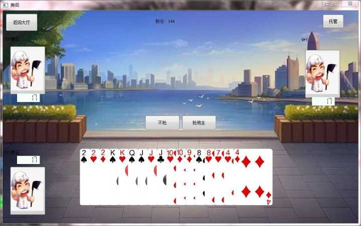

# 带有AI机器人的斗地主游戏

## 作品简介

现在的生活中，斗地主越来越流行，茶余饭后我们经常可以听到熟悉的斗地主的声音。但是现有的斗地主软件无法让我们和指定的人一起游戏，而现实中又需要扑克牌和分发整理的过程，想要和认识的人一起在线斗地主是困难重重。

本小组开发的项目——有智能AI代打的斗地主，可以有效解决这个难题，让认识的人轻松在一局游戏内互相PK。

本项目主要分为数据库、客户端和服务器三块内容。数据库记录并且维护游戏中需要用到的各种信息；服务器负责与数据库通信，完成各项功能在数据库中的查询比对，并为不同的客户端分配游戏队友；客户端负责对游戏过程进行维护，将数据及时传递给同一局游戏的其他两名成员，并且通过自身的逻辑将信息变动及时输出至屏幕。

三块内容的软件架构如下图：

## 作品功能

本软件是一个带有AI机器人功能的斗地主游戏软件，可以提供如下功能

* 玩家身份信息的注册和密码的找回；
* 为玩家登陆游戏提供认证，并保护玩家账户的安全性；
* 玩家可以查看其他玩家的积分、胜率等基本信息；
* 玩家可以和其他玩家进行斗地主游戏；
* 玩家可以选择托管，让AI机器人掌控牌局。

## 作品使用说明

* 在使用本作品客户端前，需要配置服务器数据库，用来记录用户信息。
* 需要先打开服务器，客户端根据服务器的IP地址连接。
* 客户端打开后显示登录界面，新用户可以注册，老用户可以直接登录或找回密码。

* 登录成功后显示主界面，点击中间的play按钮开始游戏

* 对战开始后玩家可以正常出牌，或点击右上角的托管按钮让智能AI帮助你出牌。

**祝您使用愉快~**

